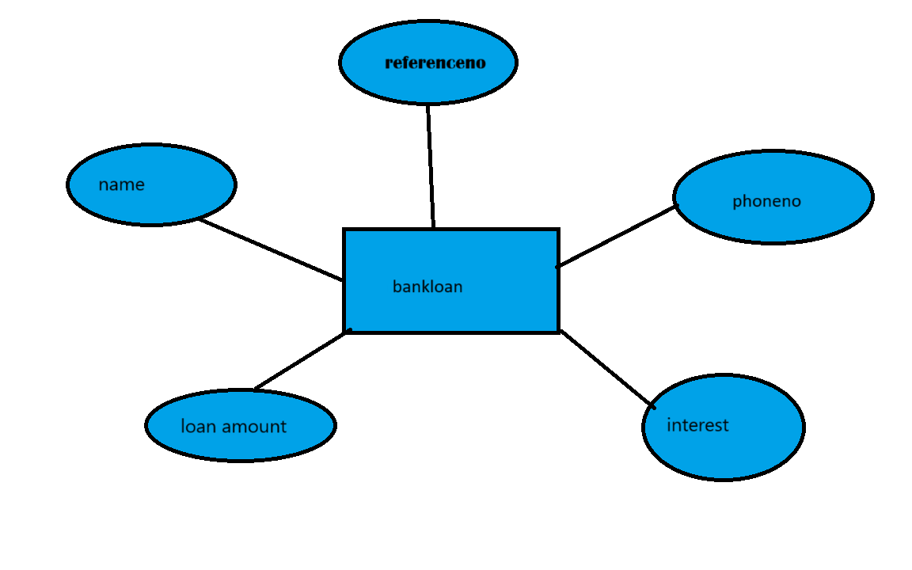

# Ex02 Django ORM Web Application
## Date: 28.10.24

## AIM
To develop a Django application to store and retrieve data from a bank loan database using Object Relational Mapping(ORM).

## ENTITY RELATIONSHIP DIAGRAM

## DESIGN STEPS

### STEP 1:
Clone the problem from GitHub

### STEP 2:
Create a new app in Django project

### STEP 3:
Enter the code for admin.py and models.py

### STEP 4:
Execute Django admin and create details for 10 books

## PROGRAM
'''
admin.py

from django.contrib import admin
from .models import bankloan,bankloanadmin
admin.site.register(bankloan,bankloanadmin)
 
 models.py

rom django.contrib import admin 
class bankloan(models.Model):
	name=models.CharField(max_length=15)
	phoneno=models.IntegerField()
	accountno=models.IntegerField(primary_key="accountno")
	loan_amount=models.IntegerField()
	interset=models.FloatField()
class bankloanadmin(admin.ModelAdmin):
list_display=('name','phoneno','accountno','loan_amount','interset')
'''

## OUTPUT
.png>)

## RESULT
Thus the program for creating a database using ORM hass been executed successfully
